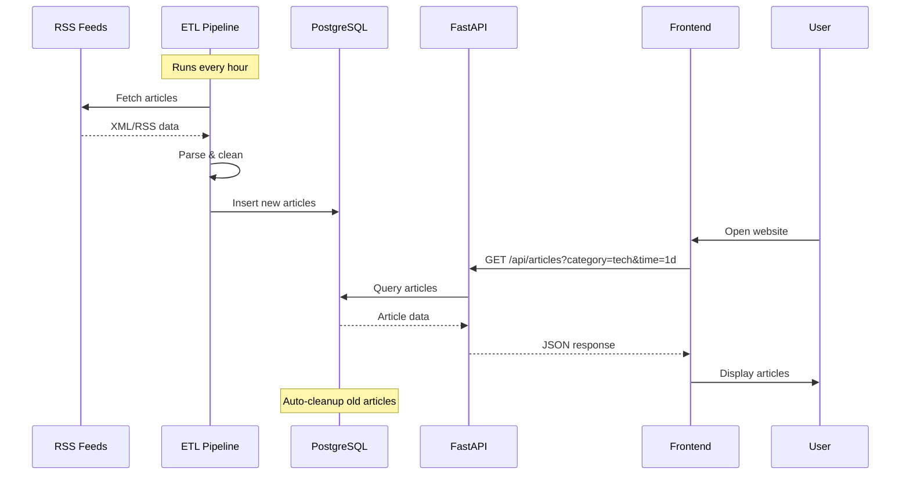
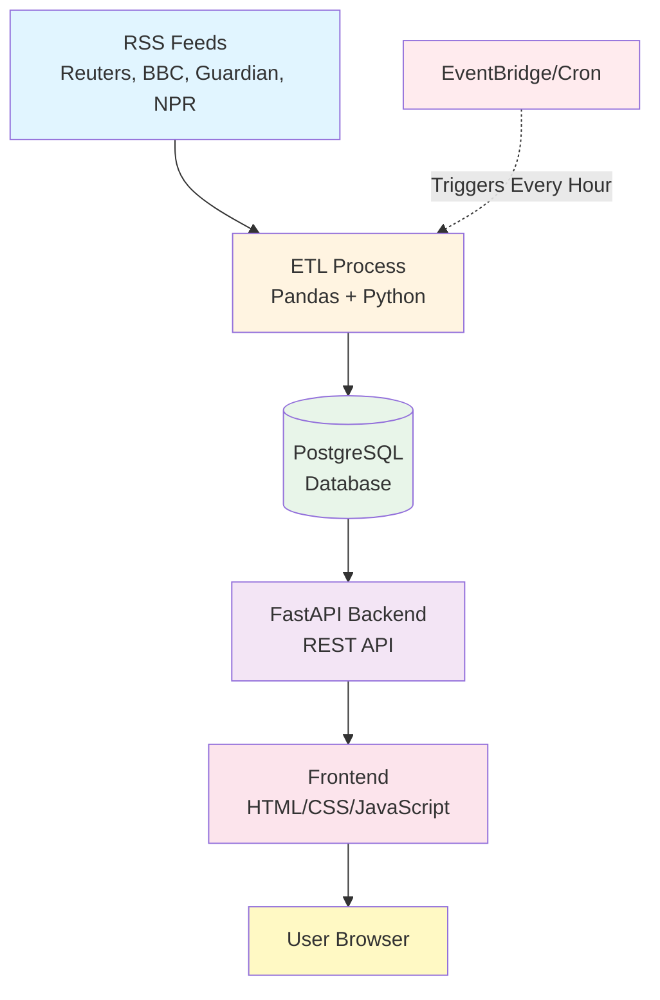
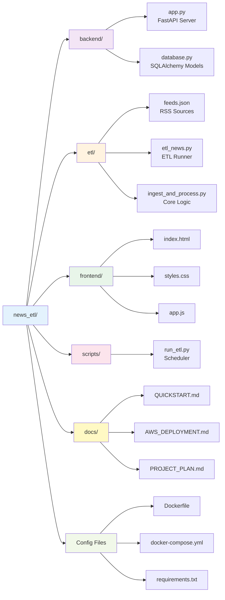

# Personal News Aggregator

A personalized news aggregation platform that collects articles from curated RSS feeds and presents them in a clean, filterable web interface.

## Screenshots

### Light Mode

*Clean, modern interface with sidebar navigation*

### Dark Mode

*Easy on the eyes for night-time reading*

### Search & Filter

*Real-time search and category filtering*

> **Note:** To add screenshots, capture images of the running application and save them in the `screenshots/` directory with the names shown above.

## Features

- 📰 **Diverse News Sources**: Top stories, India, World, Business & Finance, Science & History, Technology, Company Blogs, and Cricket
- 🔍 **Smart Filtering**: Filter by category and time range (1 hour, 1 day, 7 days)
- 🔎 **Real-time Search**: Search headlines instantly as you type
- 🎨 **Theme Options**: Light, Dark, and Sepia modes for comfortable reading
- 🎯 **Sidebar Navigation**: Clean, icon-based category browsing
- 🚀 **Modern Stack**: FastAPI backend + PostgreSQL + Responsive frontend
- ☁️ **AWS Ready**: Designed for deployment on AWS with Docker support
- 🔄 **Auto-refresh**: Scheduled ETL jobs keep content fresh
- 🧹 **Auto-cleanup**: Removes articles older than 7 days
- 📱 **Responsive Design**: Works seamlessly on desktop and mobile

## User Interface

The application features a modern, intuitive interface with:

- **Sidebar Navigation**: Quick access to all news categories with custom icons
- **Theme Switcher**: Toggle between Light ☀️, Dark 🌙, and Sepia 📜 modes (preference saved locally)
- **Search Bar**: Real-time headline filtering with instant results
- **Time Filters**: View articles from the last hour, day, or week
- **Color-Coded Cards**: Each category has a unique accent color for easy identification
- **Responsive Layout**: Sidebar transforms into a mobile-friendly top navigation on smaller screens

## Data Flow



## Architecture



## Local Development

### Prerequisites

- Python 3.11+
- PostgreSQL (or use Docker Compose)
- Git

### Setup

1. **Clone the repository**
   ```bash
   git clone <your-repo-url>
   cd news_etl
   ```

2. **Create virtual environment**
   ```bash
   python -m venv venv
   source venv/bin/activate  # On Windows: venv\Scripts\activate
   ```

3. **Install dependencies**
   ```bash
   pip install -r requirements.txt
   ```

4. **Set up environment variables**
   ```bash
   cp .env.example .env
   # Edit .env with your database credentials
   ```

5. **Start PostgreSQL** (with Docker Compose)
   ```bash
   docker-compose up -d db
   ```

6. **Initialize database**
   ```bash
   python backend/database.py
   ```

7. **Run ETL to fetch articles**
   ```bash
   python etl/etl_news.py --feeds etl/feeds.json --postgres
   ```

8. **Start the API server**
   ```bash
   uvicorn backend.app:app --reload
   ```

9. **Access the application**
   - Frontend: http://localhost:8000
   - API Docs: http://localhost:8000/docs

📚 **See [docs/QUICKSTART.md](docs/QUICKSTART.md) for detailed setup instructions.**

## Docker Deployment

Run everything with Docker Compose:

```bash
docker-compose up --build
```

This starts:
- PostgreSQL database
- FastAPI backend
- One-time ETL job

## AWS Deployment

See [docs/AWS_DEPLOYMENT.md](docs/AWS_DEPLOYMENT.md) for complete deployment guide covering:
- RDS PostgreSQL setup
- ECS Fargate deployment
- EventBridge scheduled ETL
- Networking and security

## Project Structure



## API Endpoints

### Get Articles
```
GET /api/articles?category={category}&time_range={1h|1d|7d}&limit={100}
```

### Get Categories
```
GET /api/categories
```

### Get Statistics
```
GET /api/stats
```

Old articles (7+ days, excluding bookmarks) are cleaned up automatically after every
scheduled ETL run — see `scripts/run_etl.py`.

## RSS Feed Sources

- **Top Stories**: NPR, Times of India
- **India**: Times of India, The Hindu
- **World News**: Al Jazeera, The Guardian, BBC
- **Business & Finance**: Bloomberg, Financial Times, The Economist
- **Science & History**: History Today, Smithsonian, History Extra, Nature, NASA
- **Technology**: TechCrunch, The Verge, Ars Technica, The Guardian, BBC, Hacker News
- **Company Blogs**: OpenAI, GitHub, Stack Overflow
- **Cricket**: ESPN Cricinfo

To add or modify feeds, edit `etl/feeds.json`.

## Configuration

### Environment Variables

- `DATABASE_URL`: PostgreSQL connection string
- `API_HOST`: API server host (default: 0.0.0.0)
- `API_PORT`: API server port (default: 8000)

### ETL Schedule

For production, set up scheduled runs using:
- AWS EventBridge (recommended for AWS)
- Cron job (for VPS/EC2)
- ECS Scheduled Tasks

Example cron schedule (every hour):
```bash
0 * * * * cd /path/to/news_etl && python scripts/run_etl.py
```

## Testing

Run tests:
```bash
pytest etl/tests/
```

## Documentation

- 📖 [Quick Start Guide](docs/QUICKSTART.md) - Get started in 5 minutes
- 📋 [Project Implementation Plan](docs/PROJECT_PLAN.md) - Complete roadmap from local dev to AWS
- ☁️ [AWS Deployment Guide](docs/AWS_DEPLOYMENT.md) - Deploy to AWS cloud
- 🔌 [API Documentation](http://localhost:8000/docs) - Interactive API docs (when server is running)

## Portfolio Value

This project demonstrates:
- ✅ ETL pipeline design and implementation
- ✅ REST API development with FastAPI
- ✅ Database modeling with PostgreSQL
- ✅ Frontend development
- ✅ Containerization with Docker
- ✅ AWS cloud deployment (RDS, ECS, EventBridge)
- ✅ Scheduled job automation
- ✅ Full-stack development

## License

MIT License - feel free to use this project for learning and portfolio purposes.

## Contributing

Contributions welcome! Please open an issue or submit a pull request.
