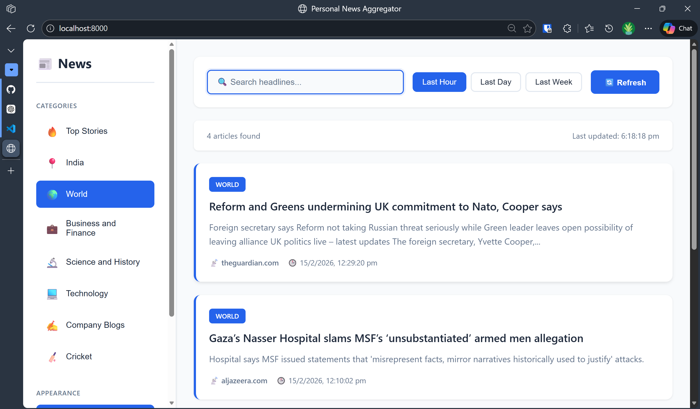
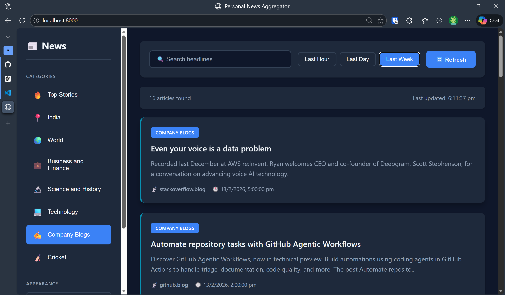
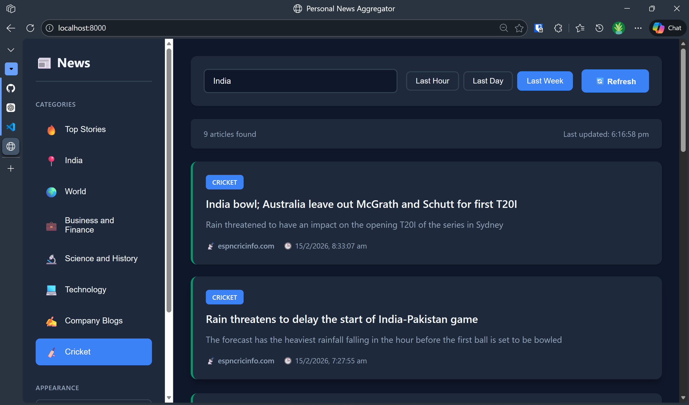
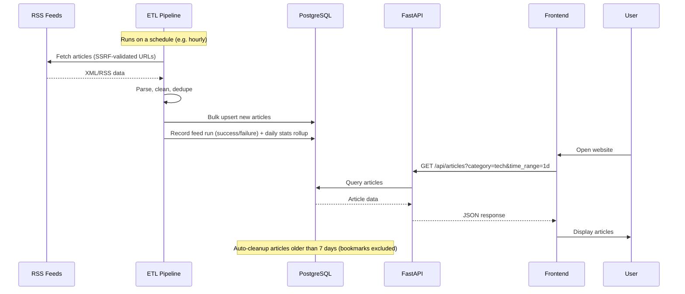

# Divij's Digest

A personal news aggregation platform that collects articles from curated RSS feeds and presents them in a clean, filterable web interface — with bookmarks, reading history, a weekly email digest, and an admin panel for managing feeds and monitoring pipeline health.

## Screenshots

### Light Mode

*Clean, modern interface with sidebar navigation*

### Dark Mode

*Easy on the eyes for night-time reading*

### Search & Filter

*Real-time search and category filtering*

## Features

- **Diverse News Sources**: Top stories, India, World, Business & Finance, Science & History, Technology, Company Blogs, and Cricket
- **Smart Filtering**: Filter by category and time range (1 hour, 1 day, 7 days), with live per-category article counts
- **Real-time Search**: Search headlines instantly as you type
- **Bookmarks & Reading History**: Save articles for later and track what you've actually read
- **Weekly Email Digest**: Optional SMTP-configured summary of the week's top articles, grouped by category
- **Admin Panel**: Manage RSS feeds (add/edit/enable/delete), view ingestion stats, and monitor per-feed health (success rate, consecutive failures) with a trend chart
- **Theme Options**: Light, Dark, and Sepia modes, saved locally
- **Responsive Design**: Off-canvas sidebar drawer on mobile, works seamlessly on desktop and mobile
- **Keyboard Shortcuts**: Quick navigation without touching the mouse (press `?` in-app for the full list)
- **Auto-refresh & Cleanup**: Scheduled ETL job ingests new articles and purges anything older than 7 days (bookmarks are exempt)

## User Interface

- **Sidebar Navigation**: Category browsing with live counts, bookmarks, and reading history
- **Theme Switcher**: Compact segmented control for Light / Dark / Sepia
- **Search Bar**: Real-time headline filtering with instant results
- **Time Filters**: View articles from the last hour, day, or week
- **Color-Coded Cards**: Each category has a unique accent color for easy identification

## Data Flow



## Architecture

- **RSS Feeds** (Reuters, BBC, Guardian, NPR, and more) — configured via the admin panel, stored in Postgres
- **ETL Process** (Pandas + Python) — fetches, cleans, dedupes, and bulk-upserts articles; records feed health and daily stats
- **PostgreSQL** — articles, bookmarks, reading history, feeds, feed run history, daily rollups
- **FastAPI Backend** — REST API for articles, bookmarks, history, feeds, and admin stats
- **Frontend** (HTML/CSS/JavaScript) — no framework, no build step
- **EventBridge/Cron** — triggers the ETL job on a schedule in production

## Local Development

### Prerequisites

- Python 3.11+
- PostgreSQL (or use Docker Compose)
- Git

### Setup

1. **Clone the repository**
   ```bash
   git clone <your-repo-url>
   cd news_etl
   ```

2. **Create virtual environment**
   ```bash
   python -m venv venv
   source venv/bin/activate  # On Windows: venv\Scripts\activate
   ```

3. **Install dependencies**
   ```bash
   pip install -r requirements.txt
   ```

4. **Set up environment variables**
   ```bash
   cp .env.example .env
   # Edit .env with your database credentials
   ```

5. **Start PostgreSQL** (with Docker Compose)
   ```bash
   docker-compose up -d db
   ```

6. **Initialize database**
   ```bash
   python backend/database.py
   ```

7. **Run ETL to fetch articles**
   ```bash
   python etl/etl_news.py --feeds etl/feeds.json --postgres
   ```

8. **Start the API server**
   ```bash
   uvicorn backend.app:app --reload
   ```

9. **Access the application**
   - Frontend: http://localhost:8000
   - Admin panel: http://localhost:8000/admin.html
   - API docs: http://localhost:8000/docs

See [docs/QUICKSTART.md](docs/QUICKSTART.md) for detailed setup instructions.

## Docker Deployment

Run everything with Docker Compose:

```bash
docker-compose up --build
```

This starts:
- PostgreSQL database
- FastAPI backend
- One-time ETL job

## AWS Deployment

See [docs/AWS_DEPLOYMENT.md](docs/AWS_DEPLOYMENT.md) for the complete deployment guide covering:
- RDS PostgreSQL setup
- ECS Fargate deployment
- EventBridge scheduled ETL
- Networking and security

## Project Structure

```
news_etl/
├── backend/        # FastAPI app, SQLAlchemy models, digest/stats logic, logging config
├── etl/            # RSS ingestion, cleaning, dedup, feed loading
├── frontend/       # index.html (main app), admin.html (feed/health admin panel), app.js, styles.css
├── scripts/        # Scheduled ETL runner, digest sender, feed seeding
├── docs/           # Quickstart, AWS deployment guide, project plan, security review
└── tests/          # Playwright end-to-end tests
```

## API Endpoints

**Articles & search**
```
GET /api/articles?category={category}&time_range={1h|1d|7d}&limit={100}
GET /api/categories?time_range={1h|1d|7d}
GET /api/stats
```

**Bookmarks**
```
GET    /api/bookmarks
POST   /api/bookmarks/{article_id}
DELETE /api/bookmarks/{article_id}
```

**Reading history**
```
GET    /api/history
POST   /api/history/{article_id}
DELETE /api/history
```

**RSS feed management**
```
GET    /api/feeds
POST   /api/feeds
PATCH  /api/feeds/{feed_id}
DELETE /api/feeds/{feed_id}
```

**Admin: health & stats**
```
GET /api/admin/stats/overview
GET /api/admin/stats/trends?days={N}
GET /api/admin/feeds/health
```

Old articles (7+ days, excluding bookmarks) are cleaned up automatically after every scheduled ETL run — see `scripts/run_etl.py`.

## RSS Feed Sources

- **Top Stories**: NPR, Times of India
- **India**: Times of India, The Hindu
- **World News**: Al Jazeera, The Guardian, BBC
- **Business & Finance**: Bloomberg, Financial Times, The Economist
- **Science & History**: History Today, Smithsonian, History Extra, Nature, NASA
- **Technology**: TechCrunch, The Verge, Ars Technica, The Guardian, BBC, Hacker News
- **Company Blogs**: OpenAI, GitHub, Stack Overflow
- **Cricket**: ESPN Cricinfo

Feeds are managed through the admin panel (`/admin.html`) and stored in the database; `etl/feeds.json` is used as a one-time seed and as a fallback if the feeds table is empty.

## Configuration

### Environment Variables

- `ENVIRONMENT`: `local` (default, allows a hardcoded local DB fallback) or anything else (requires `DATABASE_URL` to be set explicitly)
- `DATABASE_URL`: PostgreSQL connection string
- `API_HOST` / `API_PORT`: API server host/port (defaults: `0.0.0.0` / `8000`)
- `LOG_LEVEL`: Logging verbosity (default: `INFO`)
- `SMTP_HOST`, `SMTP_PORT`, `SMTP_USERNAME`, `SMTP_PASSWORD`, `SMTP_USE_TLS`: Weekly digest email delivery (omit `SMTP_HOST` to run the digest in dry-run/print mode)
- `DIGEST_FROM_EMAIL`, `DIGEST_TO_EMAIL`, `DIGEST_CATEGORIES`, `DIGEST_ARTICLES_PER_CATEGORY`: Digest content configuration

See `.env.example` for the full list with defaults.

### ETL Schedule

For production, set up scheduled runs using:
- AWS EventBridge (recommended for AWS)
- Cron job (for VPS/EC2)
- ECS Scheduled Tasks

Example cron schedule (every hour):
```bash
0 * * * * cd /path/to/news_etl && python scripts/run_etl.py
```

### Weekly Digest

```bash
python scripts/send_digest.py
```

Runs in dry-run mode (prints the digest instead of sending) until `SMTP_HOST` is configured.

## Testing

Run the Playwright end-to-end test suite:
```bash
pytest tests/e2e/
```

Run the ETL unit tests:
```bash
pytest etl/tests/
```

## Documentation

- [Quick Start Guide](docs/QUICKSTART.md) — Get started in 5 minutes
- [Project Implementation Plan](docs/PROJECT_PLAN.md) — Complete roadmap from local dev to AWS
- [AWS Deployment Guide](docs/AWS_DEPLOYMENT.md) — Deploy to AWS cloud
- [Security Review](docs/security_review.md) — Findings and fixes from a code quality/security audit
- [API Documentation](http://localhost:8000/docs) — Interactive API docs (when server is running)

## Portfolio Value

This project demonstrates:
- ETL pipeline design: fetch, clean, dedupe, bulk upsert, scheduled batch runs
- Data quality monitoring: per-feed run history, success rates, daily ingestion rollups
- REST API development with FastAPI, including admin/observability endpoints
- Database modeling with PostgreSQL and SQLAlchemy
- Frontend development without a framework (vanilla HTML/CSS/JS, hand-rolled SVG charts)
- Containerization with Docker
- AWS cloud deployment (RDS, ECS, EventBridge)
- Security-conscious ingestion (SSRF-safe URL validation, XSS-safe rendering, fail-fast credential handling)
- Full-stack development end to end

## License

MIT License - feel free to use this project for learning and portfolio purposes.

## Contributing

Contributions welcome! Please open an issue or submit a pull request.
