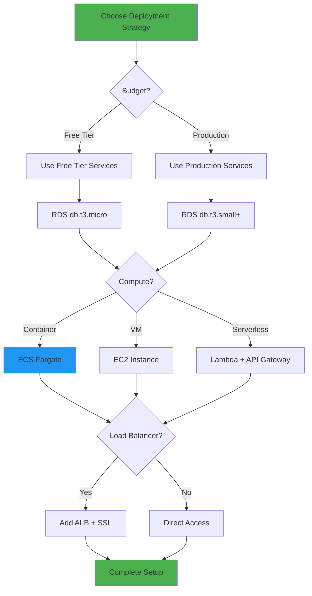
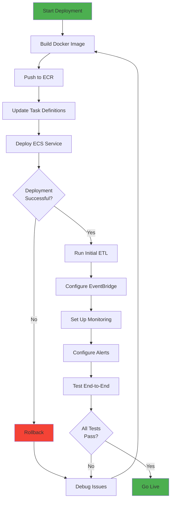
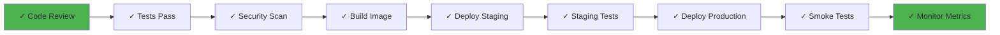
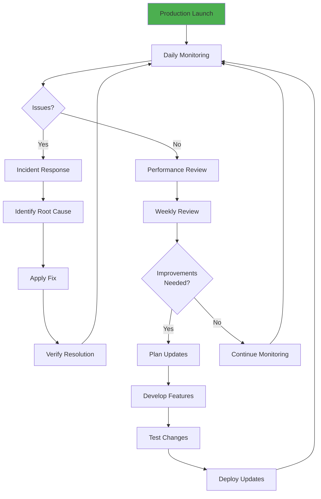
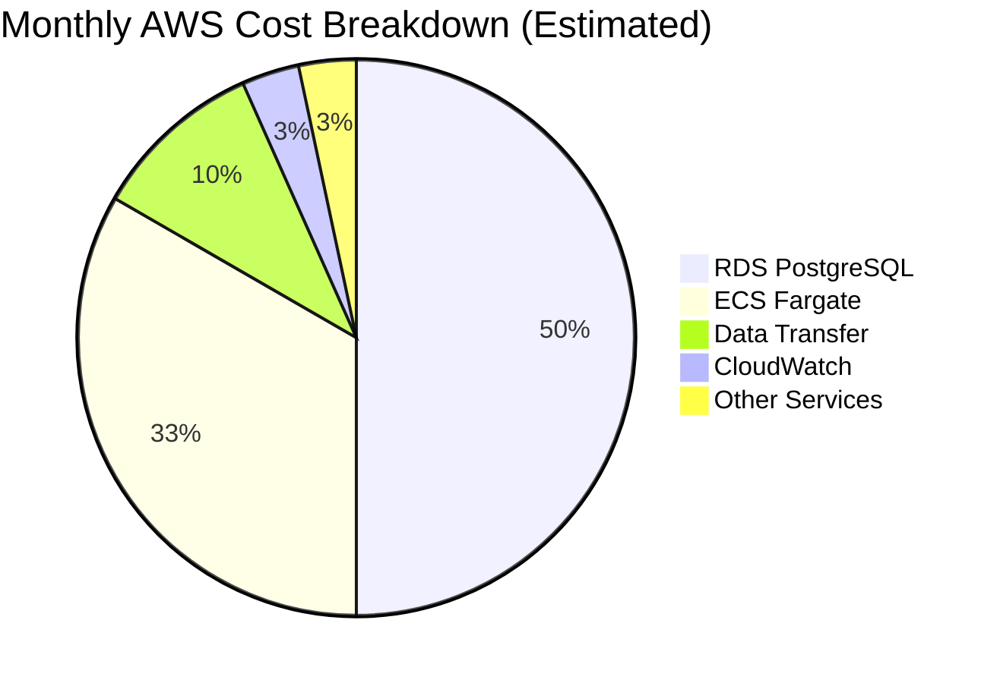
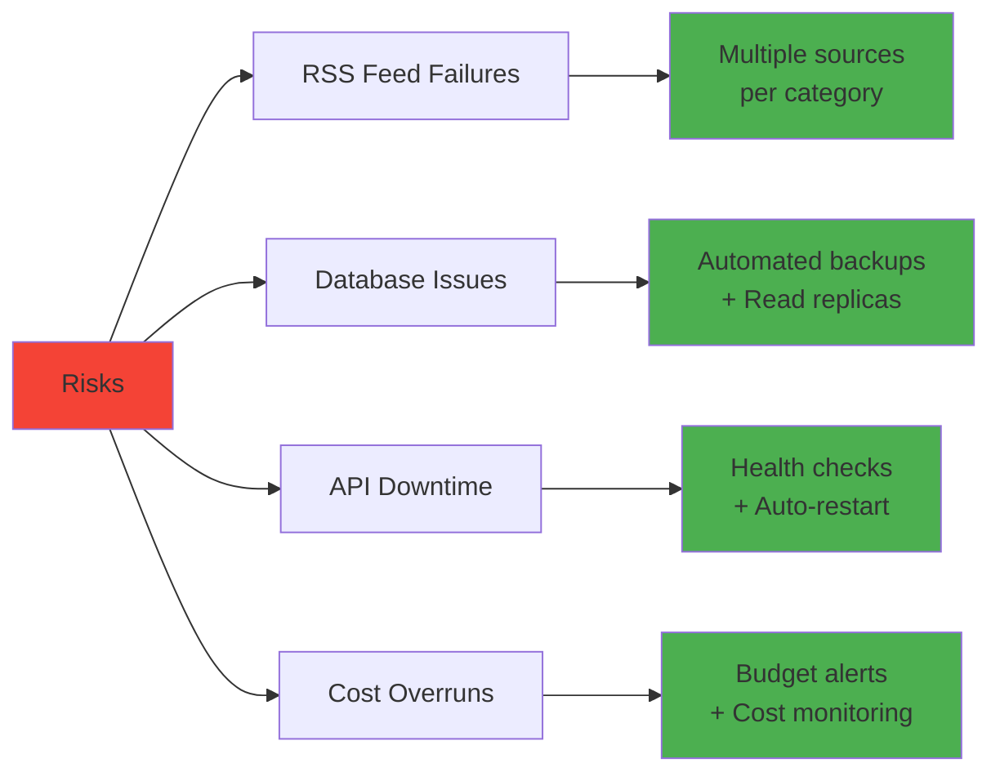

# Project Implementation Plan
## Personal News Aggregator: From Local Development to AWS Deployment

*A comprehensive roadmap for building and deploying a production-ready news aggregation platform*

---

## Table of Contents
- [Project Overview](#project-overview)
- [Implementation Phases](#implementation-phases)
- [Timeline & Milestones](#timeline--milestones)
- [Phase Details](#phase-details)
- [Risk Mitigation](#risk-mitigation)
- [Success Metrics](#success-metrics)

---

## Project Overview

### Project Goals
1. Build a personal news aggregation platform
2. Learn full-stack development (Backend, Frontend, Database, DevOps)
3. Gain hands-on AWS cloud experience
4. Create a portfolio-ready project with production deployment

### Technology Stack

- **Backend:** FastAPI, Python, SQLAlchemy
- **Frontend:** HTML5, CSS3, JavaScript
- **Data:** PostgreSQL, Pandas, RSS Feeds
- **Infrastructure:** Docker, AWS ECS, AWS RDS, EventBridge
- **DevOps:** GitHub, CI/CD, Monitoring

---

## Implementation Phases

- [**Phase 1: Local Development**](#phase-1-local-development-)
  - Project Setup
  - ETL Pipeline
  - Database Layer
  - Backend API
  - Frontend UI
- [**Phase 2: Testing & Refinement**](#phase-2-testing--refinement)
  - Local Testing
  - Add Features
  - Performance Tuning
  - Documentation
- [**Phase 3: AWS Setup**](#phase-3-aws-setup)
  - AWS Account Setup
  - RDS Configuration
  - ECR Setup
  - ECS Cluster
- [**Phase 4: Deployment**](#phase-4-deployment-to-aws)
  - Initial Deployment
  - ETL Scheduling
  - DNS & SSL
  - Monitoring Setup
- [**Phase 5: Production**](#phase-5-production-operations)
  - Production Launch
  - Performance Monitoring
  - Iteration & Updates

---

## Phase 1: Local Development
**Status:** ✅ Complete

### Objectives
- Set up development environment
- Build core application components
- Establish data pipeline

### Completed Deliverables
- ✅ ETL pipeline with Pandas
- ✅ PostgreSQL database with SQLAlchemy
- ✅ FastAPI backend with REST endpoints
- ✅ Responsive frontend (HTML/CSS/JS)
- ✅ Docker & Docker Compose setup
- ✅ Comprehensive documentation
- ✅ GitHub repository with version control

### Technical Decisions Made
| Decision | Rationale |
|----------|-----------|
| FastAPI over Flask | Better performance, automatic API docs, async support |
| PostgreSQL over SQLite | Production-ready, supports concurrent writes |
| Pandas over PySpark | Simpler for small-scale data, easier local development |
| Docker Compose | Simplified local development with multiple services |

---

## Phase 2: Testing & Refinement
**Status:** 🔄 In Progress

### Objectives
- Thoroughly test all components
- Add enhancements and features
- Optimize performance
- Refine user experience

### Tasks Checklist

#### 2.1 Automated Testing
- [x] Write pytest unit tests for ETL functions (`etl/tests/test_ingest_and_process.py`)
- [x] Create API endpoint tests (`tests/e2e/test_api.py`)
- [ ] Add database integration tests
- [ ] Set up test coverage reporting
- [ ] Configure GitHub Actions for CI (no `.github/workflows` yet — tests are local-only)
- [x] Add E2E testing with Playwright (pytest-playwright, `tests/e2e/test_*.py`)

#### 2.2 Feature Enhancements
- [x] Add search functionality (`frontend/app.js` — client-side title filter)
- [x] Implement article bookmarking/favorites (`backend/database.py` Bookmark model, `/api/bookmarks`, star button + Bookmarks view in frontend; bookmarked articles are excluded from the 7-day ETL purge)
- [x] Add email notifications for new articles (weekly digest — `backend/digest.py`, `scripts/send_digest.py`; SMTP configured via `.env`, dry-run prints digest when unconfigured)
- [x] Create admin dashboard (revisited — expanded from the RSS feed management page into a full admin panel with health/stats; see 2.6 below)
- [x] Add RSS feed management UI (`backend/database.py` Feed model, `/api/feeds` CRUD, `frontend/admin.html` admin page; ETL now reads feeds from the database, falling back to `feeds.json`)
- [ ] ~~Implement article preview/modal~~ (built then removed — the modal just echoed the card's own title/summary with no new information, so it added a click for no payoff)
- [x] Add reading history (`backend/database.py` ReadHistory model, `/api/history` log/list/clear, sidebar History view; logs a click when an article title link is opened, re-visiting updates the timestamp rather than duplicating)

#### 2.3 Performance Optimization
- [x] Add database indexing for common queries (`backend/database.py` — category, link, published_date, ingestion_timestamp indexed)
- [ ] ~~Implement caching (Redis or in-memory)~~ (skipped — deferred as premature at current scale: ~1-2k articles, single user, indexed Postgres queries already return in single-digit ms)
- [ ] ~~Optimize frontend asset loading~~ (skipped — hand-written `app.js`/`styles.css`, no bundler or heavy JS libs to optimize)
- [ ] ~~Reduce API response times~~ (skipped — no measured latency problem to fix)
- [ ] ~~Implement lazy loading for articles~~ (skipped — API responses capped at 100 articles; renders instantly as-is)

Revisit this section if the app grows to multi-user or high-traffic use (matches the original Phase 3+ production vision); not worth the added complexity for personal/portfolio use today.

#### 2.4 User Experience
- [ ] ~~Add loading states and skeletons~~ (skipped — local Postgres queries return fast enough that a loading state is barely perceptible; not worth the effort here)
- [x] Improve error messages (`frontend/app.js` `describeLoadError` — distinguishes network failure, 5xx, 404, and bookmarks vs. articles context instead of one generic message)
- [x] Add empty state designs (`frontend/app.js` `describeEmptyState` — separate messages for empty bookmarks, no search matches, and no articles in category/time range, instead of one generic message that made no sense e.g. for a fresh bookmarks list)
- [x] Implement keyboard shortcuts (`frontend/app.js` — `/` search, `Esc` clear/close, `1-8` category, `h`/`d`/`w` time range, `r` refresh, `?` help overlay)
- [x] Add dark mode toggle (`frontend/styles.css`, `frontend/app.js`)
- [x] Add a 4th "Paper" theme (`frontend/styles.css`, `frontend/index.html`) — black-and-white newsprint
      palette with a serif font stack scoped to the theme, square (non-rounded) card/panel borders, and no
      shadows. Category color-coding is intentionally dropped for this theme (newsprint reads by
      typography, not color); the admin trends chart (`frontend/admin.js` `categoryColor()`) switches to a
      grayscale palette when Paper is active, for the same reason.
- [x] Improve mobile responsiveness (`frontend/index.html`/`styles.css`/`app.js` — sidebar converted to an off-canvas drawer with hamburger toggle on mobile instead of dumping in-flow above the feed; `frontend/feeds.css`/`feeds.js` — feed form stacks, table scrolls horizontally instead of overflowing the page)

#### 2.5 Code Quality
- [x] Code review and refactoring (`docs/security_review.md` — 9 findings: 5 fixed, addressed below)
- [x] Add type hints throughout (`backend/app.py`, `etl/ingest_and_process.py`)
- [x] Improve error handling
- [x] Add logging framework (`backend/logging_config.py` — stdlib `logging` to stdout/stderr via `basicConfig`, `LOG_LEVEL` env var; replaces `print()` in `backend/`, `etl/`, `scripts/`; exception sites use `logger.exception()` to capture tracebacks. Deliberately not logging to the DB — stdout is picked up by the container log driver (Docker locally, CloudWatch on ECS) with no extra write path or failure mode to manage.)
- [x] Security audit (SQL injection, XSS) — stored XSS (`escapeHtml` in `frontend/app.js`), SSRF on feed URLs (`url_safety.py`), hardcoded DB credential fallback, and a duplicated unauthenticated cleanup endpoint were found and fixed. Two findings remain open, deliberately deferred: no auth on the feeds admin page/API (acceptable for a single-user personal tool, not exposed publicly) and a CORS config with `allow_origins=["*"]` + `allow_credentials=True` (unsafe combo, browsers already reject it, but worth tightening if this is ever exposed beyond localhost).

#### 2.6 Admin Panel: Health & Stats

Motivation: this project is a resume piece and reads more as "backend engineer who also built an ETL job"
than "data engineer." Rather than bolt on a separate analytics stack (Airflow, dbt), this extends the
existing feed-management page into a real admin panel by adding two lightweight, DE-flavored pieces on top
of ingestion the app already does: batch aggregation (rollup stats) and data quality monitoring (feed
health). A frontend trends visualization (item 4 below) is deliberately deferred — the API/data layer is
the priority; the chart is a later nice-to-have.

- [x] Add `FeedRun` table (`backend/database.py`) — one row per feed per ETL run: `feed_id` (FK), `run_at`,
      `success` (bool), `articles_fetched` (int), `error_message` (nullable). Recorded by
      `record_feed_run()` in `etl/ingest_and_process.py` after each feed fetch attempt. This is the source
      of truth for feed health (last success, consecutive failures, rolling success rate) — no separate
      status table needed. Feeds loaded from `feeds.json` (no DB id) are skipped, not errored.
- [x] Add `DailyStats` table (`backend/database.py`) — one row per `(date, category)`: `articles_ingested`
      (int), unique on `(date, category)`. Upserted at the end of each ETL run by `compute_daily_stats()`
      (`backend/stats.py`, called from `scripts/run_etl.py`), so re-running the same day recomputes rather
      than double-counts.
- [x] Add admin API endpoints: `GET /api/admin/stats/overview` (total articles, articles today, per-category
      counts over last 7/30 days, last successful ETL run time) and `GET /api/admin/feeds/health` (per-feed
      enabled state, last run time/status, consecutive failure count, rolling success rate over the last 20
      runs).
- [x] Renamed `frontend/feeds.html`/`feeds.js`/`feeds.css` → `admin.html`/`admin.js`/`admin.css`; updated the
      `/feeds.html` route in `backend/app.py` to `/admin.html`, and the sidebar link in `frontend/index.html`
      ("Manage Feeds" → "Admin Panel"). Page now has an overview-cards section (total articles, articles
      today, active feeds, feeds currently failing, last successful run) and health columns on the feed
      table (last run ✅/❌, consecutive failures highlighted red when ≥3, rolling success rate). Verified
      end-to-end via a real ETL run against live feeds (Docker) plus Playwright checks of light/dark/mobile
      rendering.
- [x] Add category trend chart to the admin panel — revisited from "deferred." New endpoint
      `GET /api/admin/stats/trends?days=N` (7/30 day toggle in the UI) reads `DailyStats` and returns a
      dense, zero-filled date-indexed series per category. Rendered as a hand-rolled multi-line SVG chart
      (`frontend/admin.js` `renderTrendsChart`/`admin.css`, no charting library) with gridlines, axis
      labels, and a color-coded legend reusing the app's existing per-category accent colors. Verified with
      Playwright across light/dark theme and both range toggles, including a manual multi-day data backfill
      to confirm the chart reads correctly once more than one day of `DailyStats` history exists.

No new scheduling infrastructure: both new writes piggyback on the existing `scripts/run_etl.py`
cron/EventBridge trigger, keeping this a downstream-of-ingestion batch step rather than a new pipeline.

#### 2.7 Sidebar Polish

Revisited after a fresh look at the sidebar mid-2.2/2.4 work — it read as generic/template-like. Scoped to
three concrete fixes rather than a full redesign.

- [x] Per-category article counts, scoped to the active time range (not all-time) so the number next to a
      category matches what you'd actually see if you clicked it. `GET /api/categories` gained an optional
      `time_range` query param (shared `_time_range_cutoff()` helper with `/api/articles`); counts refresh
      on time-range change and on manual refresh (`loadCategoryCounts()` in `frontend/app.js`). A category
      with zero matches for the range explicitly renders `0`, not a blank badge.
- [x] Replaced all sidebar emoji (categories, Library, Appearance, More) with a consistent hand-drawn
      inline SVG icon set (`stroke="currentColor"`, no external icon library/CDN) — icons now inherit the
      button's text color, so they theme correctly across light/dark/sepia and the active/selected state,
      which fixed-color emoji couldn't do.
- [x] Added a sidebar footer (`Divij's Digest v1.0`) anchored to the bottom via `.sidebar { display: flex;
      flex-direction: column }` + `margin-top: auto`, giving the sidebar a visual close instead of just
      trailing off after "More."
- [x] Visual hierarchy: "Categories" promoted to a bolder, darker primary label (`sidebar-title-primary`);
      "Library" pulled into the same visual cluster (no divider, tight spacing) since it's also navigation;
      "Appearance" and "More" demoted to a lighter secondary cluster (`sidebar-title-secondary`, smaller
      font, reduced opacity) separated from the nav cluster by one thin `.sidebar-divider`, since they're
      settings rather than navigation.
- [x] Theme switcher rebuilt as a one-row segmented control (icon + label stacked per segment, filled pill
      on the active segment) instead of three stacked full-width buttons — cut that section's height by
      roughly two-thirds.
- [x] Tightened spacing sidebar-wide (`.category-nav` gap, `.category-btn` padding, `.sidebar-section`
      margins) and gave "More" a visually lighter, more compact treatment (`category-btn-compact`) — the
      full category+library+appearance+more stack now fits without scrolling on a standard mobile drawer
      (844px) and comes close to fitting on a 900px desktop viewport, down from needing a full scroll.
- [x] Custom thin scrollbar for the sidebar's own overflow (`scrollbar-width: thin` for Firefox,
      `::-webkit-scrollbar` for Chromium/Edge), themed via `--border`/`--text-light` instead of the
      OS-default scrollbar, for whenever content still exceeds the viewport.

Verified via Playwright across light/dark/sepia themes, the mobile off-canvas drawer, and time-range
switching (confirmed counts actually change, including a genuine zero-count category), plus confirmed the
segmented theme control still correctly drives `setTheme()`/`localStorage`.

---

## Phase 3: AWS Setup
**Status:** ⏳ Pending

### Objectives
- Create and configure AWS services
- Set up production infrastructure
- Establish security and networking

### AWS Architecture Decision Tree

### Implementation Steps

#### 3.1 AWS Account Setup (Day 1)

**Tasks:**
- [ ] Create AWS account (or use existing)
- [ ] Enable Multi-Factor Authentication (MFA)
- [ ] Create IAM user with appropriate permissions
- [ ] Set up billing alerts ($10, $20, $50 thresholds)
- [ ] Install and configure AWS CLI
- [ ] Create cost budget and alerts
- [ ] Set up AWS CloudFormation templates (optional)

#### 3.2 Database Setup (Day 2)
- [ ] Create VPC and subnets
- [ ] Set up security groups
- [ ] Launch RDS PostgreSQL instance
- [ ] Configure database parameters
- [ ] Set up automated backups
- [ ] Test database connectivity
- [ ] Run database migrations

#### 3.3 Container Registry (Day 3)
- [ ] Create ECR repository
- [ ] Configure repository policies
- [ ] Build production Docker image
- [ ] Tag and push image to ECR
- [ ] Test image pull from ECR
- [ ] Set up image scanning

#### 3.4 ECS Configuration (Day 4)
- [ ] Create ECS cluster
- [ ] Define task definitions (API + ETL)
- [ ] Configure task roles and permissions
- [ ] Set up CloudWatch log groups
- [ ] Create ECS service for API
- [ ] Configure auto-scaling policies
- [ ] Set up health checks

### Security Checklist
- [ ] Use AWS Secrets Manager for credentials
- [ ] Enable encryption at rest (RDS)
- [ ] Enable encryption in transit (SSL/TLS)
- [ ] Restrict security group rules
- [ ] Use VPC endpoints for AWS services
- [ ] Enable CloudTrail logging
- [ ] Configure IAM least privilege access
- [ ] Set up WAF rules (if using ALB)

---

## Phase 4: Deployment to AWS
**Status:** ⏳ Pending

### Objectives
- Deploy application to AWS
- Configure automated scheduling
- Set up domain and SSL
- Establish monitoring and alerting

### Deployment Workflow

### Tasks Breakdown

#### 4.1 Initial Deployment (Days 1-2)
- [ ] Configure production environment variables
- [ ] Build and push Docker image
- [ ] Deploy API service to ECS
- [ ] Verify API is accessible
- [ ] Run database migrations
- [ ] Execute initial ETL job manually
- [ ] Verify data in database
- [ ] Test API endpoints
- [ ] Smoke test frontend

#### 4.2 ETL Automation (Day 3)
- [ ] Create EventBridge rule
- [ ] Configure ECS scheduled task
- [ ] Set up IAM roles for EventBridge
- [ ] Test scheduled execution
- [ ] Verify ETL runs successfully
- [ ] Monitor for failures
- [ ] Set up retry logic

#### 4.3 Domain & SSL (Day 4)
- [ ] Purchase/configure domain in Route 53
- [ ] Create hosted zone
- [ ] Request SSL certificate (ACM)
- [ ] Create Application Load Balancer
- [ ] Configure target groups
- [ ] Update DNS records
- [ ] Test HTTPS access
- [ ] Force HTTPS redirect

#### 4.4 Monitoring Setup (Day 5)
- [ ] Create CloudWatch dashboard
- [ ] Configure log retention
- [ ] Set up metric alarms
- [ ] Create SNS topics for alerts
- [ ] Configure email notifications
- [ ] Set up RDS monitoring
- [ ] Monitor ECS service health
- [ ] Test alert notifications

### Deployment Checklist

---

## Phase 5: Production Operations

**Duration:** Ongoing  
**Status:** ⏳ Pending

### Objectives
- Monitor application health
- Optimize costs
- Iterate on features
- Maintain and scale

### Operations Strategy

### Monitoring Metrics

#### Application Health
- API response times (p50, p95, p99)
- Error rates and types
- Request volume
- Database query performance
- ETL job success rate
- Article fetch success rate

#### Infrastructure Metrics
- ECS service CPU/Memory usage
- RDS CPU/Memory/Storage
- Network in/out
- Container restart count
- Task failure rate

#### Business Metrics
- Total articles in database
- Articles per category
- User engagement (if tracking)
- Feed reliability (% successful)
- Data freshness (last ETL run)

### Maintenance Tasks

#### Daily
- [ ] Review CloudWatch dashboards
- [ ] Check error logs
- [ ] Verify ETL runs
- [ ] Monitor costs

#### Weekly
- [ ] Review performance trends
- [ ] Check database size/growth
- [ ] Review security alerts
- [ ] Test backup restoration
- [ ] Review cost optimization

#### Monthly
- [ ] Update dependencies
- [ ] Security patches
- [ ] Capacity planning
- [ ] Cost analysis and optimization
- [ ] Feature prioritization

### Cost Optimization

**Optimization Strategies:**
- Use Reserved Instances for predictable workloads
- Enable RDS storage auto-scaling
- Right-size ECS tasks (CPU/Memory)
- Use Spot instances for ETL tasks (70% savings)
- Implement CloudWatch log retention policies
- Archive old articles (>30 days) to S3
- Use CloudFront CDN for static assets

---

## Enhancement Roadmap

### Short Term (Weeks 1-4)
1. **User Features**
   - Article search and filters
   - Save favorite articles
   - Email digests
   
2. **Administration**
   - RSS feed management UI
   - Analytics dashboard
   - Error monitoring

3. **Performance**
   - Redis caching layer
   - Database query optimization
   - Frontend performance tuning

### Medium Term (Months 2-3)
1. **Advanced Features**
   - Natural Language Processing (article summarization)
   - Sentiment analysis
   - Trend detection
   - Related article recommendations

2. **Social Features**
   - Share articles
   - Comments/discussions
   - User accounts and profiles

3. **Mobile**
   - Progressive Web App (PWA)
   - Mobile-optimized UI
   - Push notifications

### Long Term (Months 4-6)
1. **Scale & Performance**
   - Multi-region deployment
   - CDN integration
   - Advanced caching strategies
   - Microservices architecture

2. **Data & Analytics**
   - Machine learning for article relevance
   - User behavior analytics
   - A/B testing framework
   - Custom AI-powered digests

3. **Business Features**
   - API for third parties
   - Premium features/tiers
   - Integration with other services

---

## Risk Mitigation

### Technical Risks

| Risk | Impact | Probability | Mitigation |
|------|--------|-------------|------------|
| RSS feed downtime | Medium | High | Multiple sources per category, error handling |
| Database failure | High | Low | Automated backups, point-in-time recovery |
| API service crash | High | Medium | Health checks, auto-restart, monitoring |
| Cost overruns | Medium | Medium | Budget alerts, cost tracking, optimization |
| Security breach | High | Low | Regular updates, security scanning, WAF |
| Data loss | High | Low | Daily backups, replication, testing |

### Operational Risks

| Risk | Mitigation Strategy |
|------|---------------------|
| Insufficient monitoring | Comprehensive CloudWatch dashboards and alerts |
| Knowledge gaps | Detailed documentation, runbooks, training |
| Maintenance burden | Automation, CI/CD, Infrastructure as Code |
| Scaling issues | Auto-scaling policies, capacity planning |

---

## Success Metrics

### Technical Metrics
- ✅ **Uptime:** >99% availability
- ✅ **Performance:** API responses <200ms (p95)
- ✅ **Reliability:** ETL success rate >95%
- ✅ **Error Rate:** <1% of requests
- ✅ **Data Freshness:** Articles <1 hour old

### Learning Objectives
- ✅ Understand full-stack development
- ✅ Gain AWS hands-on experience
- ✅ Learn DevOps practices
- ✅ Build production-grade application
- ✅ Create portfolio-worthy project

### Portfolio Value
- ✅ Demonstrates end-to-end ownership
- ✅ Shows cloud deployment experience
- ✅ Highlights system design skills
- ✅ Proves problem-solving ability
- ✅ Live, working production application

---

## Resource Requirements

### Development Tools
- IDE (VS Code, PyCharm)
- Docker Desktop
- PostgreSQL client (pgAdmin, DBeaver)
- API testing tool (Postman, Insomnia)
- Git client

### AWS Services
- **Compute:** ECS Fargate
- **Database:** RDS PostgreSQL
- **Storage:** ECR, S3
- **Networking:** VPC, ALB, Route 53
- **Scheduling:** EventBridge
- **Monitoring:** CloudWatch, SNS
- **Security:** IAM, Secrets Manager, ACM

### Estimated Costs
- **Development:** Free (local)
- **AWS (Free Tier):** $0 for 12 months
- **AWS (Post Free Tier):** $20-30/month
- **Domain:** $10-15/year
- **Total Year 1:** ~$150-180

---

## Next Steps

### Immediate Actions (This Week)
1. ✅ Complete local development
2. ⏳ Write comprehensive tests
3. ⏳ Add missing features
4. ⏳ Optimize performance
5. ⏳ Update documentation

### Short Term (Next 2 Weeks)
1. Create AWS account and configure
2. Set up RDS PostgreSQL
3. Deploy to ECS
4. Configure monitoring
5. Go live!

### Long Term (Next 3 Months)
1. Monitor and optimize
2. Add advanced features
3. Implement ML/AI capabilities
4. Scale infrastructure
5. Document learnings for resume

---

## Conclusion

This implementation plan provides a structured approach to building and deploying a professional-grade news aggregation platform. The phased approach allows for:

- **Learning:** Gradual skill building from local dev to cloud deployment
- **Iteration:** Continuous improvement and feature additions
- **Risk Management:** Proper testing before production deployment
- **Portfolio Value:** Demonstrable experience with modern tech stack

**Current Status:** Phase 1 complete ✅, Phase 2 in progress 🔄

**Next Milestone:** Complete testing and refinement, then move to AWS deployment

---

*Last Updated: August 22, 2026*
