# Project Implementation Plan
## Personal News Aggregator: From Local Development to AWS Deployment

*A comprehensive roadmap for building and deploying a production-ready news aggregation platform*

---

## Table of Contents
- [Project Overview](#project-overview)
- [Implementation Phases](#implementation-phases)
- [Timeline & Milestones](#timeline--milestones)
- [Phase Details](#phase-details)
- [Risk Mitigation](#risk-mitigation)
- [Success Metrics](#success-metrics)

---

## Project Overview

### Project Goals
1. Build a personal news aggregation platform
2. Learn full-stack development (Backend, Frontend, Database, DevOps)
3. Gain hands-on AWS cloud experience
4. Create a portfolio-ready project with production deployment

### Technology Stack

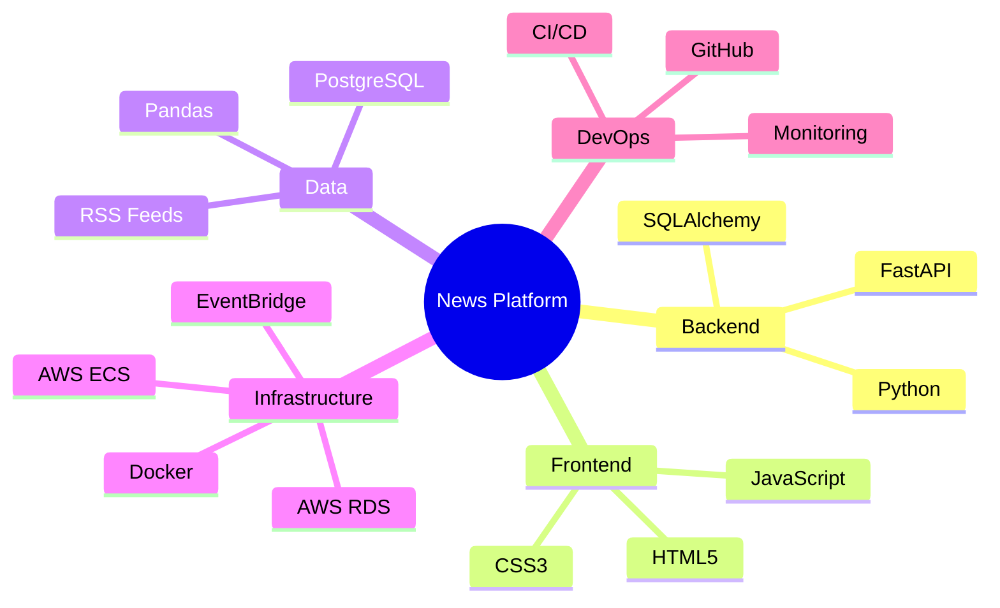

---

## Implementation Phases

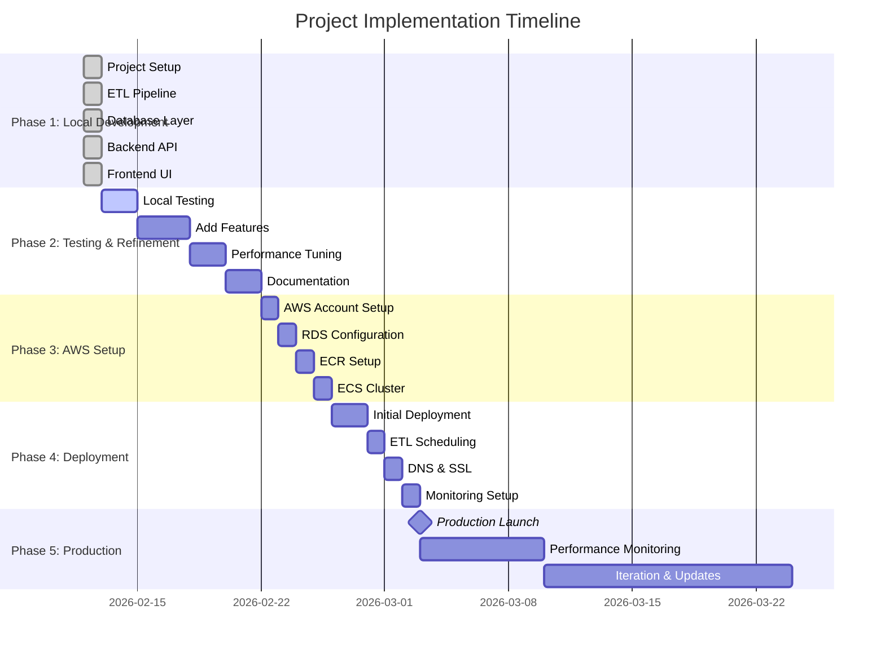

---

## Phase 1: Local Development ✅

**Duration:** Completed (Feb 12, 2026)  
**Status:** ✅ Complete

### Objectives
- Set up development environment
- Build core application components
- Establish data pipeline

### Implementation Workflow

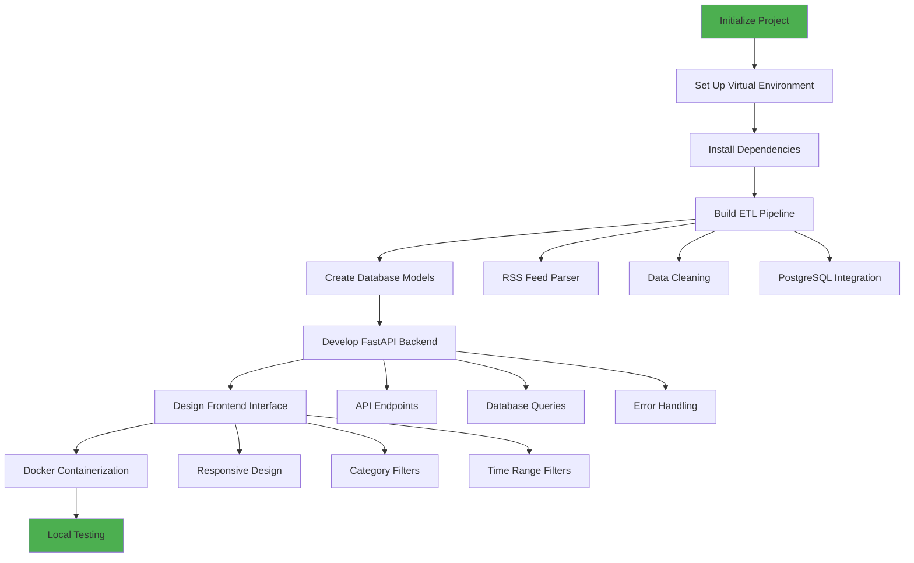

### Completed Deliverables
- ✅ ETL pipeline with Pandas
- ✅ PostgreSQL database with SQLAlchemy
- ✅ FastAPI backend with REST endpoints
- ✅ Responsive frontend (HTML/CSS/JS)
- ✅ Docker & Docker Compose setup
- ✅ Comprehensive documentation
- ✅ GitHub repository with version control

### Technical Decisions Made
| Decision | Rationale |
|----------|-----------|
| FastAPI over Flask | Better performance, automatic API docs, async support |
| PostgreSQL over SQLite | Production-ready, supports concurrent writes |
| Pandas over PySpark | Simpler for small-scale data, easier local development |
| Docker Compose | Simplified local development with multiple services |

---

## Phase 2: Testing & Refinement

**Duration:** 7-10 days  
**Status:** 🔄 In Progress

### Objectives
- Thoroughly test all components
- Add enhancements and features
- Optimize performance
- Refine user experience

### Testing Strategy

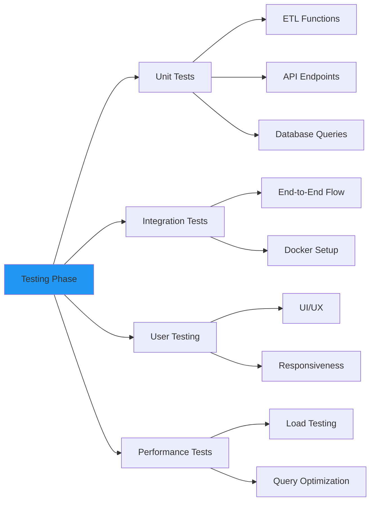

### Tasks Checklist

#### 2.1 Automated Testing
- [ ] Write pytest unit tests for ETL functions
- [ ] Create API endpoint tests
- [ ] Add database integration tests
- [ ] Set up test coverage reporting
- [ ] Configure GitHub Actions for CI

#### 2.2 Feature Enhancements
- [ ] Add search functionality
- [ ] Implement article bookmarking/favorites
- [ ] Add email notifications for new articles
- [ ] Create admin dashboard
- [ ] Add RSS feed management UI
- [ ] Implement article preview/modal

#### 2.3 Performance Optimization
- [ ] Add database indexing for common queries
- [ ] Implement caching (Redis or in-memory)
- [ ] Optimize frontend asset loading
- [ ] Reduce API response times
- [ ] Implement lazy loading for articles

#### 2.4 User Experience
- [ ] Add loading states and skeletons
- [ ] Improve error messages
- [ ] Add empty state designs
- [ ] Implement keyboard shortcuts
- [ ] Add dark mode toggle
- [ ] Improve mobile responsiveness

#### 2.5 Code Quality
- [ ] Code review and refactoring
- [ ] Add type hints throughout
- [ ] Improve error handling
- [ ] Add logging framework
- [ ] Security audit (SQL injection, XSS)

### Testing Workflow

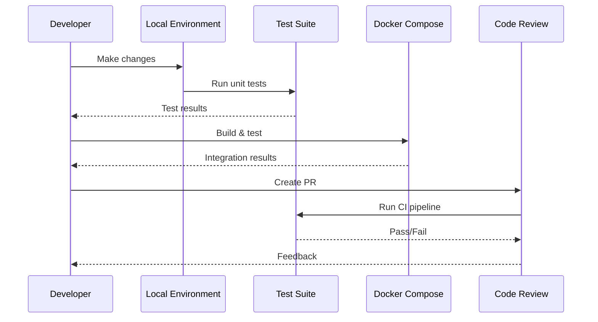

---

## Phase 3: AWS Setup

**Duration:** 4-5 days  
**Status:** ⏳ Pending

### Objectives
- Create and configure AWS services
- Set up production infrastructure
- Establish security and networking

### AWS Architecture Decision Tree

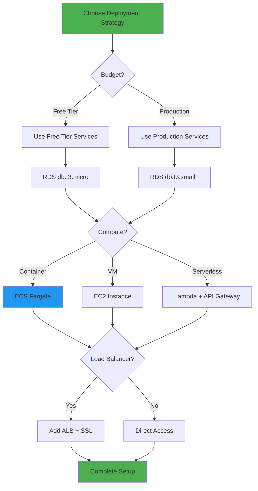

### Implementation Steps

#### 3.1 AWS Account Setup (Day 1)
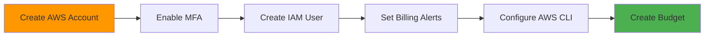

**Tasks:**
- [ ] Create AWS account (or use existing)
- [ ] Enable Multi-Factor Authentication (MFA)
- [ ] Create IAM user with appropriate permissions
- [ ] Set up billing alerts ($10, $20, $50 thresholds)
- [ ] Install and configure AWS CLI
- [ ] Create cost budget and alerts
- [ ] Set up AWS CloudFormation templates (optional)

#### 3.2 Database Setup (Day 2)
- [ ] Create VPC and subnets
- [ ] Set up security groups
- [ ] Launch RDS PostgreSQL instance
- [ ] Configure database parameters
- [ ] Set up automated backups
- [ ] Test database connectivity
- [ ] Run database migrations

#### 3.3 Container Registry (Day 3)
- [ ] Create ECR repository
- [ ] Configure repository policies
- [ ] Build production Docker image
- [ ] Tag and push image to ECR
- [ ] Test image pull from ECR
- [ ] Set up image scanning

#### 3.4 ECS Configuration (Day 4)
- [ ] Create ECS cluster
- [ ] Define task definitions (API + ETL)
- [ ] Configure task roles and permissions
- [ ] Set up CloudWatch log groups
- [ ] Create ECS service for API
- [ ] Configure auto-scaling policies
- [ ] Set up health checks

### Security Checklist
- [ ] Use AWS Secrets Manager for credentials
- [ ] Enable encryption at rest (RDS)
- [ ] Enable encryption in transit (SSL/TLS)
- [ ] Restrict security group rules
- [ ] Use VPC endpoints for AWS services
- [ ] Enable CloudTrail logging
- [ ] Configure IAM least privilege access
- [ ] Set up WAF rules (if using ALB)

---

## Phase 4: Deployment to AWS

**Duration:** 4-5 days  
**Status:** ⏳ Pending

### Objectives
- Deploy application to AWS
- Configure automated scheduling
- Set up domain and SSL
- Establish monitoring and alerting

### Deployment Workflow

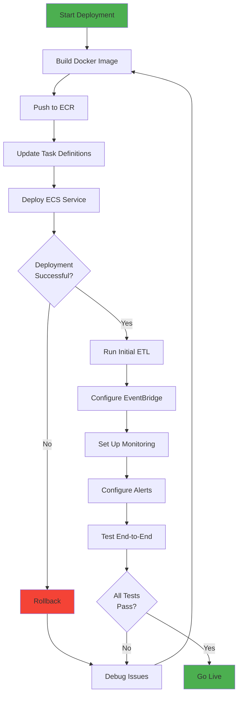

### Tasks Breakdown

#### 4.1 Initial Deployment (Days 1-2)
- [ ] Configure production environment variables
- [ ] Build and push Docker image
- [ ] Deploy API service to ECS
- [ ] Verify API is accessible
- [ ] Run database migrations
- [ ] Execute initial ETL job manually
- [ ] Verify data in database
- [ ] Test API endpoints
- [ ] Smoke test frontend

#### 4.2 ETL Automation (Day 3)
- [ ] Create EventBridge rule
- [ ] Configure ECS scheduled task
- [ ] Set up IAM roles for EventBridge
- [ ] Test scheduled execution
- [ ] Verify ETL runs successfully
- [ ] Monitor for failures
- [ ] Set up retry logic

#### 4.3 Domain & SSL (Day 4)
- [ ] Purchase/configure domain in Route 53
- [ ] Create hosted zone
- [ ] Request SSL certificate (ACM)
- [ ] Create Application Load Balancer
- [ ] Configure target groups
- [ ] Update DNS records
- [ ] Test HTTPS access
- [ ] Force HTTPS redirect

#### 4.4 Monitoring Setup (Day 5)
- [ ] Create CloudWatch dashboard
- [ ] Configure log retention
- [ ] Set up metric alarms
- [ ] Create SNS topics for alerts
- [ ] Configure email notifications
- [ ] Set up RDS monitoring
- [ ] Monitor ECS service health
- [ ] Test alert notifications

### Deployment Checklist

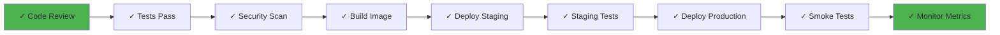

---

## Phase 5: Production Operations

**Duration:** Ongoing  
**Status:** ⏳ Pending

### Objectives
- Monitor application health
- Optimize costs
- Iterate on features
- Maintain and scale

### Operations Strategy

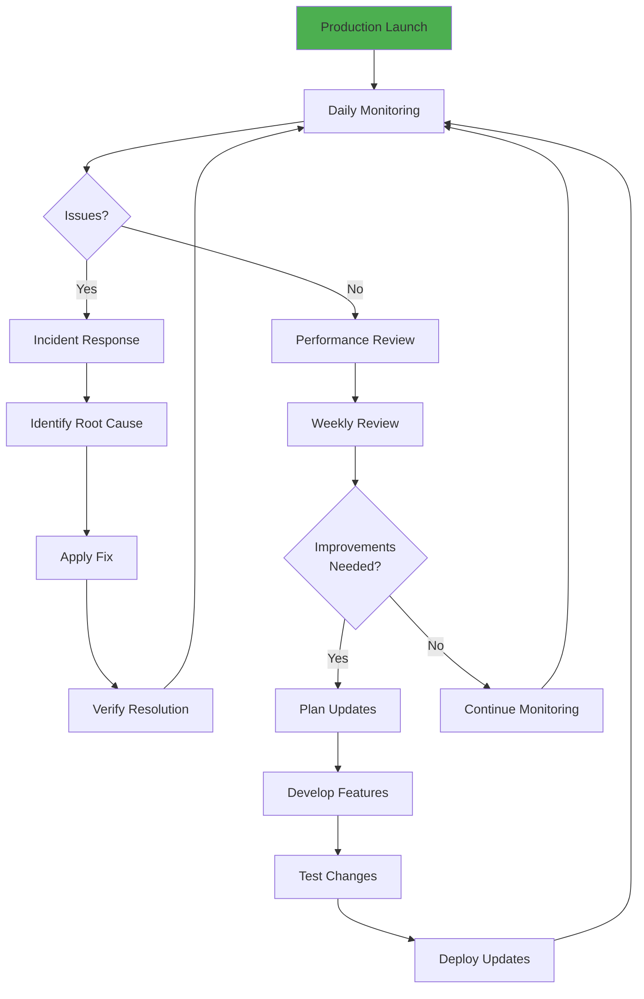

### Monitoring Metrics

#### Application Health
- API response times (p50, p95, p99)
- Error rates and types
- Request volume
- Database query performance
- ETL job success rate
- Article fetch success rate

#### Infrastructure Metrics
- ECS service CPU/Memory usage
- RDS CPU/Memory/Storage
- Network in/out
- Container restart count
- Task failure rate

#### Business Metrics
- Total articles in database
- Articles per category
- User engagement (if tracking)
- Feed reliability (% successful)
- Data freshness (last ETL run)

### Maintenance Tasks

#### Daily
- [ ] Review CloudWatch dashboards
- [ ] Check error logs
- [ ] Verify ETL runs
- [ ] Monitor costs

#### Weekly
- [ ] Review performance trends
- [ ] Check database size/growth
- [ ] Review security alerts
- [ ] Test backup restoration
- [ ] Review cost optimization

#### Monthly
- [ ] Update dependencies
- [ ] Security patches
- [ ] Capacity planning
- [ ] Cost analysis and optimization
- [ ] Feature prioritization

### Cost Optimization

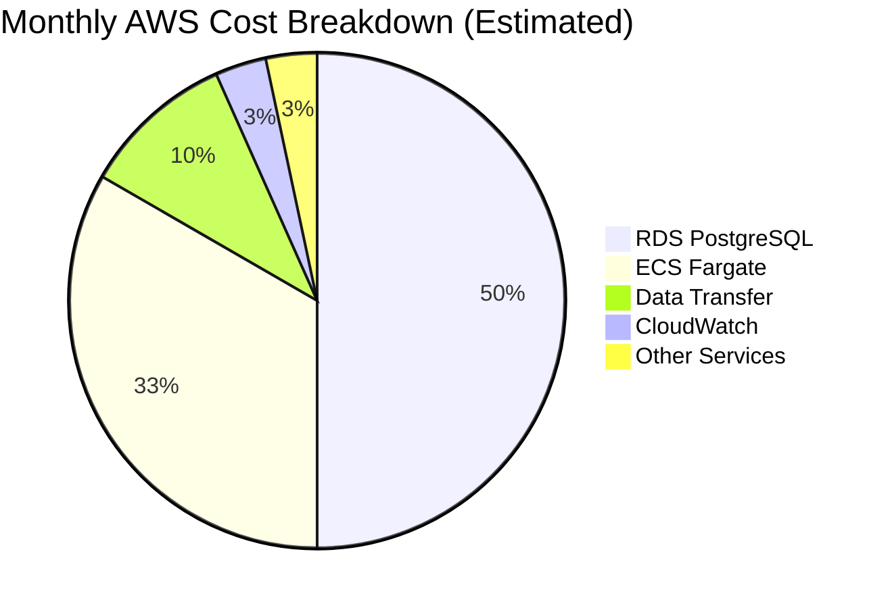

**Optimization Strategies:**
- Use Reserved Instances for predictable workloads
- Enable RDS storage auto-scaling
- Right-size ECS tasks (CPU/Memory)
- Use Spot instances for ETL tasks (70% savings)
- Implement CloudWatch log retention policies
- Archive old articles (>30 days) to S3
- Use CloudFront CDN for static assets

---

## Enhancement Roadmap

### Short Term (Weeks 1-4)
1. **User Features**
   - Article search and filters
   - Save favorite articles
   - Email digests
   
2. **Administration**
   - RSS feed management UI
   - Analytics dashboard
   - Error monitoring

3. **Performance**
   - Redis caching layer
   - Database query optimization
   - Frontend performance tuning

### Medium Term (Months 2-3)
1. **Advanced Features**
   - Natural Language Processing (article summarization)
   - Sentiment analysis
   - Trend detection
   - Related article recommendations

2. **Social Features**
   - Share articles
   - Comments/discussions
   - User accounts and profiles

3. **Mobile**
   - Progressive Web App (PWA)
   - Mobile-optimized UI
   - Push notifications

### Long Term (Months 4-6)
1. **Scale & Performance**
   - Multi-region deployment
   - CDN integration
   - Advanced caching strategies
   - Microservices architecture

2. **Data & Analytics**
   - Machine learning for article relevance
   - User behavior analytics
   - A/B testing framework
   - Custom AI-powered digests

3. **Business Features**
   - API for third parties
   - Premium features/tiers
   - Integration with other services

---

## Risk Mitigation

### Technical Risks

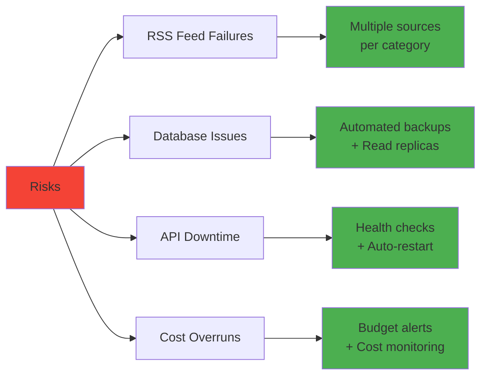

| Risk | Impact | Probability | Mitigation |
|------|--------|-------------|------------|
| RSS feed downtime | Medium | High | Multiple sources per category, error handling |
| Database failure | High | Low | Automated backups, point-in-time recovery |
| API service crash | High | Medium | Health checks, auto-restart, monitoring |
| Cost overruns | Medium | Medium | Budget alerts, cost tracking, optimization |
| Security breach | High | Low | Regular updates, security scanning, WAF |
| Data loss | High | Low | Daily backups, replication, testing |

### Operational Risks

| Risk | Mitigation Strategy |
|------|---------------------|
| Insufficient monitoring | Comprehensive CloudWatch dashboards and alerts |
| Knowledge gaps | Detailed documentation, runbooks, training |
| Maintenance burden | Automation, CI/CD, Infrastructure as Code |
| Scaling issues | Auto-scaling policies, capacity planning |

---

## Success Metrics

### Technical Metrics
- ✅ **Uptime:** >99% availability
- ✅ **Performance:** API responses <200ms (p95)
- ✅ **Reliability:** ETL success rate >95%
- ✅ **Error Rate:** <1% of requests
- ✅ **Data Freshness:** Articles <1 hour old

### Learning Objectives
- ✅ Understand full-stack development
- ✅ Gain AWS hands-on experience
- ✅ Learn DevOps practices
- ✅ Build production-grade application
- ✅ Create portfolio-worthy project

### Portfolio Value
- ✅ Demonstrates end-to-end ownership
- ✅ Shows cloud deployment experience
- ✅ Highlights system design skills
- ✅ Proves problem-solving ability
- ✅ Live, working production application

---

## Resource Requirements

### Development Tools
- IDE (VS Code, PyCharm)
- Docker Desktop
- PostgreSQL client (pgAdmin, DBeaver)
- API testing tool (Postman, Insomnia)
- Git client

### AWS Services
- **Compute:** ECS Fargate
- **Database:** RDS PostgreSQL
- **Storage:** ECR, S3
- **Networking:** VPC, ALB, Route 53
- **Scheduling:** EventBridge
- **Monitoring:** CloudWatch, SNS
- **Security:** IAM, Secrets Manager, ACM

### Estimated Costs
- **Development:** Free (local)
- **AWS (Free Tier):** $0 for 12 months
- **AWS (Post Free Tier):** $20-30/month
- **Domain:** $10-15/year
- **Total Year 1:** ~$150-180

---

## Next Steps

### Immediate Actions (This Week)
1. ✅ Complete local development
2. ⏳ Write comprehensive tests
3. ⏳ Add missing features
4. ⏳ Optimize performance
5. ⏳ Update documentation

### Short Term (Next 2 Weeks)
1. Create AWS account and configure
2. Set up RDS PostgreSQL
3. Deploy to ECS
4. Configure monitoring
5. Go live!

### Long Term (Next 3 Months)
1. Monitor and optimize
2. Add advanced features
3. Implement ML/AI capabilities
4. Scale infrastructure
5. Document learnings for resume

---

## Conclusion

This implementation plan provides a structured approach to building and deploying a professional-grade news aggregation platform. The phased approach allows for:

- **Learning:** Gradual skill building from local dev to cloud deployment
- **Iteration:** Continuous improvement and feature additions
- **Risk Management:** Proper testing before production deployment
- **Portfolio Value:** Demonstrable experience with modern tech stack

**Current Status:** Phase 1 complete ✅, Phase 2 in progress 🔄

**Next Milestone:** Complete testing and refinement, then move to AWS deployment

---

*Last Updated: February 12, 2026*
